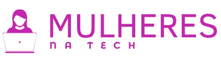
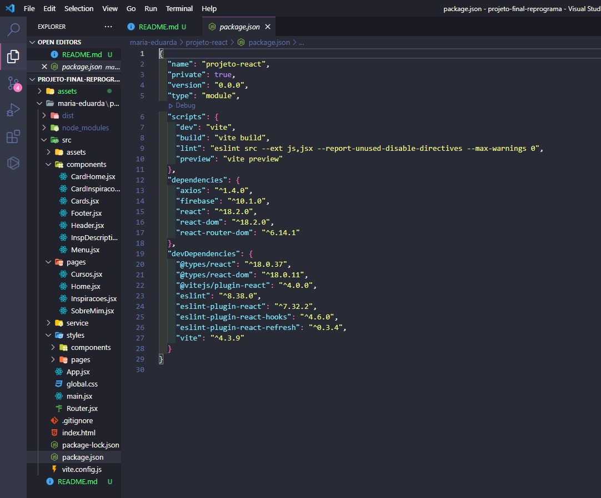

<h1  align="center">

</h1>

## Apresentação

### Quem é a Maduh? 

 

[Maria Eduarda](https://www.instagram.com/_maduhb/), 

Tenho 23 anos, sou sagitariana e moro em Recife. 
Sou uma ex-estudante de nutrição migrando para a área de tecnologia e resolvi dedicar o ano de 2023 para estudar e aprimorar meus conhecimentos nessa nova área. Iniciar essa trajetória pela Reprograma foi, sem dúvida alguma, a melhor escolha que poderia ter feito. Embora tenha sido um desafio, encontrei um ambiente extremamente acolhedor, no qual mesmo chegando sem nenhum conhecimento prévio, encontrei mulheres que sempre acreditaram em meu potencial e demonstraram imensa paciência. O fato de ter iniciado meu aprendizado da maneira correta fez toda a diferença para que eu pudesse prosseguir com confiança em meu novo caminho.

#### Contatos

-  [E-mail](maria.eferreira99@gmail.com) 

-  [LinkedIn](https://www.linkedin.com/in/maria-eduarda-ferreira-aab205270/) 

-  [GitHub](https://github.com/Maria-ef) 

## Conhecendo o projeto "Mulheres na Tech" 

### 🧠 Contexto

Antes de tomar a decisão de migrar para uma nova área de atuação, conduzi extensa pesquisa sobre as possibilidades dentro do campo da tecnologia. Enfrentei o desafio de buscar informações em diversas fontes, sem uma orientação precisa sobre onde procurar, e deparei-me, em sua maioria, com perspectivas masculinas. Tal situação gerou certa insegurança, especialmente por ser mulher, e levantou questionamentos sobre a adequação de minhas escolhas profissionais.

Diante dessa realidade, surgiu a motivação para criar um website com o propósito de reunir informações abrangentes sobre as áreas da tecnologia. O foco desse portal será fornecer dados relevantes sobre cursos voltados especificamente para mulheres interessadas em ingressar nesse campo. Além disso, o site será enriquecido com relatos inspiradores de mulheres que já atuam no setor de tecnologia da informação, com o objetivo de incentivar e instilar confiança nas iniciantes que se deparam com os desafios iniciais da carreira. Acredito que este tipo de plataforma teria sido extremamente valioso em meu próprio início nessa jornada profissional.

### O site conterá 4 páginas:

* Home

* Cursos

* Inspirações

* Sobre Mim/Contato

### Todas as páginas terão os componentes:

* Menu

* Header (exceto a última página)

* Footer

## Estrutura do projeto

 

 

##  `Tecnologias que utilizei` // ADD OU MODIFICAR ALGUMAS TECNOLOGIAS  

| Ferramenta | Descrição |

| `ReactJS` | Framework web |

| `Vite` | Gerador de projeto de front-end |

| `npm` | Gerenciador de pacotes |

| `Firebase` | Ferramenta realtime database para gravar as mensagens de contato |

| `Module CSS` | Ferramenta para ter mais produtividade ao estilizar a aplicação |

| `React router dom` | Dependência para criar rotas no reactjs |

| `Netlify` | Hospedagem para a aplicação |

| `Github` | Hospedagem do código fonte integrado com gerenciador de versionamento |

 

###  `Como rodar o projeto localmente` 

Siga os passos e inclua as informações abaixo:

|&nbsp;&nbsp;&nbsp;&nbsp; Passo &nbsp;&nbsp;&nbsp;&nbsp;&nbsp;| &nbsp;&nbsp;&nbsp;Comando/informação &nbsp;&nbsp;&nbsp;|

| Faça o fork | `botão de forkar` |

| Faça o clone | `git clone` |

| Instale as dependências após acessar a pasta projeto | `npm i` |

| Crie as variáveis de ambiente para integrar com Firebase e inclua os valores da sua conta | `conforme .env.example e lista abaixo`|

| Rode o projeto | `npm run dev` |

**Variáveis de ambiente**

* VITE_API_KEY=

* VITE_AUTH_DOMAIN=

* VITE_PROJECT_ID=

* VITE_STORAGE_BUCKET=

* VITE_MESSAGING_SENDER_ID=

* VITE_APP_ID=

* VITE_DATABASE_URL=

 

## 💪 Desafios 

- Maior desafio desse projeto foi conseguir colocar em prática todas as ideias que estavam na minha cabeça.

- Outro desafio foi vencer minhas inseguranças e utilizar array e objetos para a construção dos cards, além de fazer animação neles com o CSS. 

## 💪 Aprendizados

- Aprendi com esse projeto que devo confiar mais em mim e que sou capaz de mais coisas do que imagino.

- Também aprendi a usar melhor o react, o firebase, além de utilizar array e objetos, fazer os cards da Home girarem, colocar opção de "mostrar mais" e "mostrar menos" nas descrições dos cards e várias outras coisas que fui exercitando e aprendendo ao longo do projeto.

## 😎 Próximos passos mapeados

- Mais informações nos cards das áreas da tecnologia, como média salarial, por exemplo...

- Fazer um carrossel com os cards da Home para evitar quantidade grande de informações na tela ao mesmo tempo...

- Ajuste na estética e responsidade nos cards dos cursos...

- Criar um espaço na página "Inspirações" onde outras mulheres também possam enviar suas histórias...

- Criar o menu hambúrguer...

## Citação e Agradecimento  

Por fim, quero agradecer a minha família (especialmente minha mãe e meu namorado) e meus amigos por terem me apoiado tanto nesse processo, a mim mesma por ter me esforçado e não desistido e por último, mas não menos importante, às meninas da Reprograma, tanto a facilitadora, como professoras e minhas colegas de turma que sempre estiveram apoiando e dispostas a ajudar umas as outras!